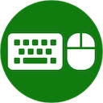
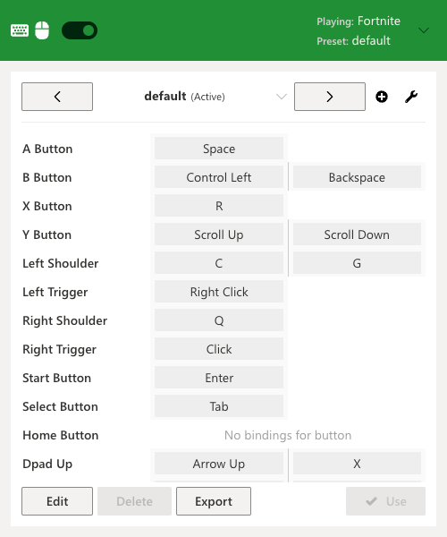
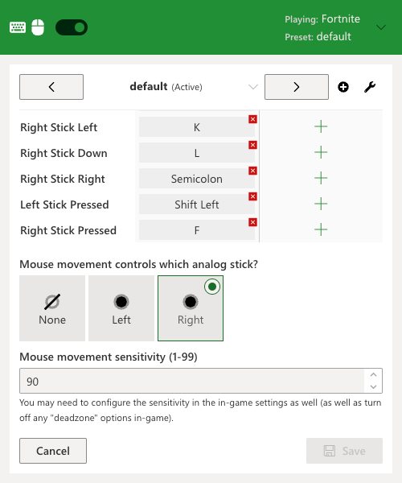

  

<h1 align="center">Keyboard & Mouse for xCloud</h1>

    
    

***

<h3 align="center">Download</h3>

***

  <b>NOTE</b> This is a fan project - it is not affiliated with Microsoft or Xbox in any way.
  All Microsoft, Xbox logos/icons/trademarks are copyright of their respective owners.

***🎮 No controller? No problem!***

A browser extension to control any game on [Xbox Cloud Gaming (Project xCloud)](https://xbox.com/play)  with a keyboard and mouse.

## The issue with xCloud

Microsoft's cloud gaming service [Xbox Cloud Gaming (aka Project xCloud)](https://xbox.com/play) lets you play your favorite Xbox games in the cloud, but it runs on physical Xbox **consoles** (not PCs) behind the scenes.

Since very few games on Xbox consoles support mouse and keyboard as first-class input devices, Microsoft chose to limit xCloud users to only using gamepad controllers to play. This extension fixes that restriction!

## Features

 

### ✅ Works for every game

- Every game on xCloud is supported - regardless of whether or not it natively supports mouse and keyboard

### ✅ Quick enable/disable

- Easily disable the mouse/keyboard override and switch back to your controller whenever you feel like it with one click

### ✅ Configurable sensitivity

- Control how sensitive you want mouse movement to be on a per-profile basis
- *(Note you may also need to tweak the control sensitivity in the game options as well for optimal use)*

### ✅ Multiple presets

- Manage multiple preset and custom configurations (e.g. create separate presets for "fighting games", "shooter", etc.)
- Bind multiple keyboard keys or mouse buttons to any controller button

### ✅ Respects your privacy

- No keyboard/mouse data is ever recorded or sent anywhere from your computer
- The extension only runs on [xCloud](https://xbox.com/play) and [gamepad-tester.com](https://gamepad-tester.com); not other sites you visit

## How to enable

Just install the extension in your browser and go to [xCloud](https://xbox.com/play)! If you want to customize the default preset for your button mappings click the icon in the Extensions toolbar (it may not be pinned by default after install).

You may need to configure the sensitivity in the in-game settings as well (and it is recommended to turn off any "deadzone" options in the game).

## How it works

This extension works by acting as a **"virtual" controller**. It listens for keyboard presses and (optionally) mouse movement and translates these into what appear as *controller* button presses and analog stick movements.

There is no added input delay introduced by this extension - all keyboard/mouse input is instantly translated into virtual controller input immediately by the extension without any extra software or steps.

## Show your support

Like this extension? Why not [buy me a coffee](https://www.buymeacoffee.com/idolize)? I really appreciate it!

You can also purchase the premium version directly inside the extension 🙏

## Need help?

Feel free to [file an issue](https://github.com/idolize/xcloud-keyboard-mouse/issues), [post on Reddit](https://www.reddit.com/r/xcloudkeyboardmouse/), or [join the Discord discussion](https://discord.gg/5Jp9drge9m).
